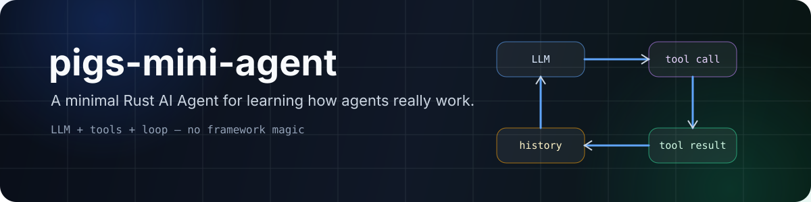

 

  

**A small, self-contained teaching implementation of a general-purpose AI Agent in Rust.**

---

## What is this?

pigs-mini-agent is meant to answer one question:

> **What is actually happening underneath tools like Claude Code, Cursor, or Codex?**

At the core, an Agent is surprisingly small:

~~~text
user message
    │
    ▼
conversation history
    │
    ▼
call the LLM
    │
    ├── text only ───────────────► return to user
    │
    └── tool call
            │
            ▼
        execute tool
            │
            ▼
      append tool result
            │
            └──────────────► call the LLM again
~~~

The intelligence comes from the **LLM**.  
The Agent runtime mainly provides **memory, tools, execution, and the loop**.

This crate keeps that loop visible instead of hiding it behind a large framework.

---

## Why this project exists

<table>
<tr>
<td width="33%" valign="top">

### 🧠 Learn the loop
Read a compact implementation of the full Agent control flow.

</td>
<td width="33%" valign="top">

### 🛠️ Learn tool use
See how tool schemas, tool calls, execution, and tool results connect together.

</td>
<td width="33%" valign="top">

### 🦀 Learn it in Rust
Use async Rust, enums, traits, typed errors, and HTTP APIs in a real Agent example.

</td>
</tr>
</table>

The project is intentionally **self-contained**. You do not need to jump across a multi-crate workspace to understand the full path from user input to LLM tool use.

---

## Core architecture

~~~text
┌─────────────────────────────────────────────────────────────┐
│                       Agent::chat()                         │
│                                                             │
│  user input ─► messages ─► LlmClient::chat()               │
│                               │                             │
│                               ▼                             │
│                    OpenAI-compatible API                    │
│                               │                             │
│                      ┌────────┴────────┐                    │
│                      ▼                 ▼                    │
│                  text reply        tool_calls               │
│                      │                 │                    │
│                      │                 ▼                    │
│                      │           ToolRegistry               │
│                      │                 │                    │
│                      │        ┌────────┼────────┐           │
│                      │        ▼        ▼        ▼           │
│                      │      bash   read/write   edit        │
│                      │        │        │        │           │
│                      │        └────────┼────────┘           │
│                      │                 ▼                    │
│                      │           tool results               │
│                      │                 │                    │
│                      └──── finish ◄────┴── continue loop    │
└─────────────────────────────────────────────────────────────┘
~~~

The loop is bounded: the default maximum is **50 rounds**, preventing an Agent from running forever if the model gets stuck repeatedly calling tools.

---

## Built-in tools

| Tool | Purpose | Design note |
|---|---|---|
| <code>bash</code> | Execute shell commands | Gives the Agent a general execution primitive |
| <code>read_file</code> | Read files with line-oriented output | Lets the model inspect local context |
| <code>write_file</code> | Create / overwrite files and parent directories | Minimal file creation primitive |
| <code>edit_file</code> | Replace one uniquely matched text fragment | Avoids fragile line-number editing |

### Why does <code>edit_file</code> use unique text matching?

Line numbers are a poor interface for LLM editing: the model can count incorrectly, and the target can shift after previous edits.

Instead, <code>edit_file</code> takes:

~~~text
old_string → new_string
~~~

The old text must match exactly once. If it is ambiguous, the model has to provide more surrounding context.

That makes failures explicit and successful edits easier to verify.

---

## Quick start

### 1. Set an API key

~~~bash
export OPENAI_API_KEY="sk-xxxx"
~~~

### 2. Run the interactive example

~~~bash
cargo run --example chat
~~~

Optional configuration:

~~~bash
export OPENAI_BASE_URL="https://api.openai.com/v1"
export OPENAI_MODEL="gpt-4o"
~~~

The LLM client uses the **OpenAI-compatible Chat Completions API**, so it can also work with compatible providers such as DeepSeek, Qwen, Kimi, Ollama, and similar gateways.

Examples:

~~~bash
# DeepSeek
export OPENAI_BASE_URL="https://api.deepseek.com/v1"
export OPENAI_MODEL="deepseek-chat"

# Qwen
export OPENAI_BASE_URL="https://dashscope.aliyuncs.com/compatible-mode/v1"
export OPENAI_MODEL="qwen-plus"

# Ollama
export OPENAI_BASE_URL="http://localhost:11434/v1"
export OPENAI_MODEL="llama3"
~~~

---

## Minimal code

~~~rust
use pigs_mini_agent::{create_default_tools, Agent, LlmClient};

#[tokio::main]
async fn main() -> pigs_mini_agent::Result<()> {
    let llm = LlmClient::from_env()?;
    let tools = create_default_tools();
    let mut agent = Agent::new(llm, tools);

    let response = agent
        .chat("Create a hello.txt file containing Hello, Agent!")
        .await?;

    println!("{response}");
    Ok(())
}
~~~

That is enough to create a working tool-using Agent.

---

## LLM client behavior

The built-in <code>LlmClient</code> deliberately keeps the protocol simple:

- OpenAI-compatible **Chat Completions** only;
- non-streaming responses;
- tool calling via the standard <code>tools</code> / <code>tool_calls</code> fields;
- a 120-second HTTP timeout;
- retry on HTTP <code>429</code> and server-side <code>5xx</code> failures;
- exponential backoff;
- up to 3 retries for retryable requests.

Non-streaming responses are a teaching choice. Streaming tool calls require reconstructing fragmented tool arguments from SSE deltas, which obscures the Agent loop with transport complexity.

---

## Learning path

The repository is organized so you can read it from data structures to the main loop:

| Order | File | What to learn |
|---|---|---|
| 1 | [<code>src/message.rs</code>](./src/message.rs) | Conversation history and message representation |
| 2 | [<code>src/tool.rs</code>](./src/tool.rs) | The <code>Tool</code> trait and <code>ToolRegistry</code> |
| 3 | [<code>src/prompt.rs</code>](./src/prompt.rs) | How the system prompt describes behavior and tools |
| 4 | [<code>src/llm.rs</code>](./src/llm.rs) | Building requests and parsing LLM responses |
| 5 | [<code>src/tools/</code>](./src/tools) | Concrete tool implementations |
| 6 | [<code>src/agent.rs</code>](./src/agent.rs) | **The Agent loop — the heart of the project** |
| 7 | [<code>src/error.rs</code>](./src/error.rs) | Typed error handling |
| 8 | [<code>src/lib.rs</code>](./src/lib.rs) | Public crate surface and module structure |

---

## Teaching documentation

The project includes several levels of documentation:

<table>
<tr>
<td width="33%" valign="top">

### 🌐 HTML guide
[<code>docs/html/</code>](./docs/html)

A browser-readable teaching site with a terminal-style visual design.

</td>
<td width="33%" valign="top">

### 📖 Markdown chapters
[<code>docs/00-overview.md</code>](./docs/00-overview.md) → [<code>docs/07-error.md</code>](./docs/07-error.md)

Step-by-step conceptual chapters with source walkthroughs.

</td>
<td width="33%" valign="top">

### 🦀 Rust API docs

~~~bash
cargo doc --open
~~~

Generated directly from the extensive source comments.

</td>
</tr>
</table>

Recommended starting point: **[docs/00-overview.md](./docs/00-overview.md)**.

---

## Design choices

### Self-contained instead of framework-heavy

The point is to make the control flow inspectable. The crate therefore does not depend on the larger pigs architecture.

### Chinese source comments

The implementation contains detailed Chinese teaching comments explaining **why** the code is structured the way it is, not only what each line does.

### Non-streaming by design

Streaming is useful in production, but it adds transport complexity that is not required to understand tool-using Agent behavior.

### Explicit bounded loop

The Agent defaults to 50 rounds so a bad tool-call cycle cannot continue indefinitely.

---

## Inspirations

The implementation was informed by several Agent / coding-tool architectures:

| Project | Main idea studied |
|---|---|
| CoreCoder | Minimal Agent loop, tool design, unique-match editing, prompt structure |
| claw-code / claw-analog | Rust Agent control-flow patterns |
| Codex | Layered architecture and message modeling |
| pigs | Typed Rust patterns and broader Agent-system architecture |

This repository is intended as a small teaching implementation rather than a drop-in reproduction of any one of them.

---

## Tech stack

---

## License

MIT — see [LICENSE](./LICENSE).

For the Chinese version, see **[READMEch.md](./READMEch.md)**.
